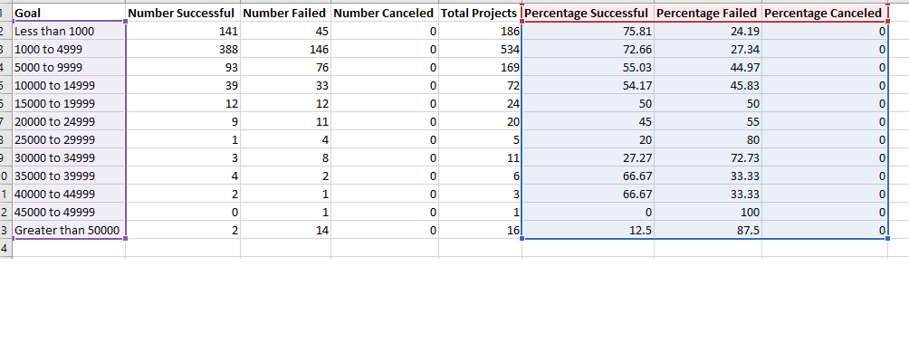

# Kickstarting with Excel

## Overview of Project
This report looks at the impact of launch date and campaign goal in the success of each campaign. These two variables can impac the outcome in that an unreasonable goal can put off donars while a launch date relative to the time of the year can impact the turnout. As such, this report will use the data from Louise's campaign in interpreting the impact of these variables and therefore inform future decision making.

### Purpose
The purpose of this project was to evalute the varying level of success achieved for different categories of kickstarter campaigns relative to launch date and goal of the campaign. It's an analysis of the data from Louise's campaign to find trends in the data.

## Analysis and Challenges
This project was analyzed using excel's pivot tables and in-built 'COUNTIFS' functions. These are powerful tools that allows for the manipulation of data to enable Louise to easily visualize the trends. While the in-built COUNTIFS function is easy to use, pivot tables and chart involves a lot of step which can represent a challenge to new users of the tool. 

### Analysis of Outcomes Based on Launch Date

### Analysis of Outcomes Based on Goals

### Challenges and Difficulties Encountered

## Results

- What are two conclusions you can draw about the Outcomes based on Launch Date?

Contributions peak during the months of March, May and June while it start to slope off in July. This could be attributed to general activities of the locals around those Month. For example in the US, this is a time when students all over the country closes schools and join the economy in numbers. This could significantly increase success of theaters and campaigns related to the.

Another Observable feature of outcomes based on launch date is that all the campaign (sucessful, failed, canceled) follows a genral trends. They peak at the same time and drop off around the months of July and eventually flatten off in December. This launch date do not determine the success or failure of a campaign  instead Louise can turn to other factors to analyze why some campaigns failed leading to cancellations for others. 

- What can you conclude about the Outcomes based on Goals?

Outcomes based on goals behave very differently based on its success, failure and or if it's canceled. Successful campaigns start to slope off when the contribution goals reached between 20000 to 24999 and continue with the downtown until at least 30000 to 34999. This make sense in that the genral public are willing to contribute until it's too expensive and it slope off while the richer donors pick it up at about 30000. Campaigns drop off at about 45000 as no donors are willing to pay at that point. 
Failed campaigns ramp up as the campaign amounts increases and even get more acute the higher the contribution amounts get.

- What are some limitations of this dataset?

While you can clearly see failed and successful campaigns, it's hard to derive possible reasons that lead to the failure of the campaigns. This information can only be more clearer when more of the data such as the types of campaign become available. Information of the demograpghy of donors can also help shed lights on why some campaigns are a success while others fail

- What are some other possible tables and/or graphs that we could create?

Other tables that may give more information includes subcategory tables that will illustrate what subcategory and campaign was more sucessful and which one was not. Which subcategory surpassed its goal the most and what are the possible reason for that etc etc. 
Here is an example: 
